# Kiến trúc Kỹ thuật Hệ thống Giám sát Camera AI (SentriAI Mini)

## 1. Tổng quan Kiến trúc System Context & Topology

SentriAI Mini được thiết kế theo mô hình **Monolithic Modular Services** kết hợp giữa Python Backend và React Frontend thời gian thực. Hệ thống bao gồm 8 module chức năng chính giao tiếp qua REST API, WebSocket và In-Memory Bus để đảm bảo độ trễ nhỏ hơn 1 giây từ lúc phát hiện đối tượng bằng mô hình **YOLOv26** đến khi hiển thị cảnh báo trên giao diện React Web UI.

```mermaid
graph TD
    UI[web-ui: React SPA / Next.js Dashboard] <-- REST API / WebSocket --> API[api-gateway: FastAPI Backend]
    API <-- Inter-module Calls --> VIS[ai-vision-pipeline: YOLOv26 & LPR Engine]
    API <-- Media Serving --> STOR[database-storage: SQLite & Local Disk]
    VIS <-- Frame Ingestion --> STRM[video-stream-service: OpenCV Capture]
    VIS --> META[area-metadata-publisher: Realtime Snapshot Stream]
    VIS --> CACHE[zone-cache: In-Memory by Camera]
    VIS --> EVT[event-clip-manager: Deduplication & Clip Slicer]
    META --> API
    CACHE --> VIS
    EVT --> ALT[alert-dispatcher: Real-time Beep & Telegram Bot]
    EVT --> STOR
    API <-- Query Engine --> QA[llm-qa-agent: Text-to-SQL Assistant]
    QA --> STOR
```



---

## 2. Danh sách Module & Trách nhiệm (Module Boundaries)

### `web-ui` — Web Frontend Dashboard
- **Trách nhiệm**: Cung cấp React UI với 4 Trang/Tab chính (Gate Dashboard, Area Security Dashboard, Zone & Tag Settings, AI Chatbot Assistant), 4 Shared Components (Header, Sidebar, Audio Beep Alert Player, Video Modal 10s), vẽ zone SVG Canvas, biểu đồ KPI Recharts, phát âm thanh cảnh báo bíp.
- **Công nghệ**: Vite + React (hoặc Next.js App Router), Tailwind CSS, Lucide React icons, Recharts, SVG Canvas.

### `api-gateway` — FastAPI Gateway & Server
- **Trách nhiệm**: Cung cấp REST endpoints cho cấu hình zone, gán nhãn xe, upload dataset, truy vấn sự kiện, đính kèm static media và duy trì WebSocket connection.
- **Công nghệ**: Python 3.11, FastAPI, Uvicorn, WebSockets.

### `video-stream-service` — Ingestion Stream Loop
- **Trách nhiệm**: Đọc video stream từ RTSP hoặc file MP4 giả lập (`GATE-01.mp4`, `BAI-KIEM.mp4`), giải mã khung hình (frame decoding) ở tốc độ FPS cố định (&ge; 5 FPS).
- **Công nghệ**: OpenCV (cv2.VideoCapture), Threading Queue.

### `ai-vision-pipeline` — YOLO-World, YOLOv8 & LPR OCR Engine
- **Trách nhiệm**: Chạy mô hình **Ultralytics YOLO-World v2** (`yolov8s-worldv2.pt`) cho Area Zone Monitoring (phát hiện linh hoạt Người, Xe nâng, Xe container, Máy móc...), YOLOv8 + EasyOCR/PaddleOCR cho biển số xe Cổng GATE-01, và đánh giá tâm BBox trong đa giác (Point-in-Polygon).
- **Công nghệ**: Ultralytics YOLO-World v2, YOLOv8, PyTorch, OpenCV, EasyOCR / PaddleOCR, Shapely / Ray-Casting PIP.

### `zone-cache` — In-memory Zone Rules Runtime
- **Trách nhiệm**: Duy trì bản sao zone/rule đang hoạt động theo `camera_id` trong memory, phục vụ trực tiếp cho frame loop area monitoring; nhận refresh/invalidation sau CRUD zone từ control plane mà không yêu cầu DB read ở từng frame.
- **Công nghệ**: Python in-memory map, async lock/atomic swap, cache versioning.

### `area-metadata-publisher` — Realtime Area Snapshot Lane
- **Trách nhiệm**: Chuyển kết quả nhận diện theo frame thành snapshot metadata ổn định cho UI khu vực, gồm object list, zone hit, zone version, stream status, latency và KPI feed gần realtime; tách biệt khỏi event persistence lane.
- **Công nghệ**: FastAPI WebSocket broadcast, lightweight serializer, in-memory fan-out queue.

### `event-clip-manager` — Event & Clip Processor
- **Trách nhiệm**: Lọc trượt trùng lặp (Cooldown 10-15s), phân loại mức độ cảnh báo (Mức 1/2/3), trích xuất và ghi file MP4 10s đính kèm bản ghi sự kiện vào DB.
- **Công nghệ**: FFmpeg / OpenCV VideoWriter, SQLite SQLAlchemy.

### `alert-dispatcher` — Real-time Multi-channel Alert
- **Trách nhiệm**: Phản hồi sự kiện Mức 3 qua WebSocket tới Web UI (kích hoạt `<AudioBeepPlayer>`) và đẩy notification kèm ảnh crop qua Telegram Bot API / Zalo OA.
- **Công nghệ**: Python asyncio, HTTPX / Telegram Bot API.

### `llm-qa-agent` — AI Event Q&A Engine
- **Trách nhiệm**: Nhận câu hỏi ngôn ngữ tự nhiên từ Web UI, chuyển đổi câu hỏi thành câu lệnh SQL (Text-to-SQL), thực thi trên DB sự kiện, trả về kết quả số liệu + đính kèm link clip 10s.
- **Công nghệ**: OpenAI / Gemini API / Ollama, Rule-based Fallback Matcher.

### `database-storage` — CSDL & Disk Storage
- **Trách nhiệm**: Lưu trữ bảng thông tin Camera, Zone, Vehicle Whitelist/Blacklist, Custom Label, Event, và lưu file ảnh crop BBox, video MP4 10s trên ổ đĩa local.
- **Công nghệ**: SQLite3, Local File System (`/data/clips/`, `/data/crops/`).

---

## 3. Ma trận Thực thi & Ranh giới Runtime (Framework & Runtime Boundary Matrix)

### 3.1 Cấu trúc Thư mục Frontend mới (`web-ui`)

```text
frontend/
├── public/                      # Static public assets (sounds, demo clips, favicons)
└── src/ (hoặc app/)             # Client App Entrypoint
    ├── assets/                  # Tailwind directives & CSS styles
    ├── components/              # Shared UI Components & Layouts
    │   ├── layout/
    │   │   ├── Header.tsx       # Shared Top Navigation & Status Indicators
    │   │   └── Sidebar.tsx      # Shared Left Navigation Sidebar
    │   ├── common/
    │   │   ├── AudioBeepPlayer.tsx  # Shared Audio Beep Alert Player Component
    │   │   └── VideoModal.tsx       # Shared 10s Evidence Video Modal Component
    │   ├── dashboard/           # KPI cards, Recharts charts, Realtime Event Cards
    │   └── zone/                # Interactive SVG Canvas Polygon Zone Editor
    ├── pages/ (hoặc tabs/)      # 4 Trang/Tab chính
    │   ├── GateDashboard.tsx            # Tab 1: Màn hình Cổng Vào LPR
    │   ├── AreaSecurityDashboard.tsx   # Tab 2: Màn hình Giám sát Khu vực
    │   ├── ZoneTagSettings.tsx         # Tab 3: Cài đặt Zone & Gán nhãn Xe/Đối tượng
    │   └── AIChatbotAssistant.tsx      # Tab 4: Hỏi đáp AI Assistant
    ├── hooks/                   # Custom React Hooks (useWebSocket, usePolygonEditor, useAudioAlert)
    ├── context/                 # React Context (AppStateContext, AlertContext)
    ├── services/                # API client (Axios/Fetch), WebSocket connection manager
    ├── types/                   # TypeScript Type definitions (Event, Zone, Vehicle, KPI)
    ├── App.tsx                  # Root Application Component
    └── main.tsx                 # Client App Entrypoint
```

### 3.2 Phân định Ranh giới Runtime (Runtime Boundary Matrix)

```
+-----------------------------------------------------------------------------------+
|                                 CLIENT BROWSER RUNTIME                             |
|  - React Client App ('use client' State & Custom Hooks: useWebSocket, useAudio)   |
|  - Shared Components: Header, Sidebar, AudioBeepPlayer, VideoModal 10s            |
|  - 4 Main Pages: Gate Dashboard, Area Security, Zone & Tag Settings, AI Chatbot   |
|  - UI Libraries: Tailwind CSS, Lucide React icons, Recharts KPI Visualizers       |
|  - SVG Canvas Component (<PolygonZoneEditor> Interactive Polygon Node Drag)       |
+-----------------------------------------------------------------------------------+
                                         ^
                                         | REST API / WebSocket Protocols
                                         v
+-----------------------------------------------------------------------------------+
|                                 PYTHON BACKEND RUNTIME                            |
|  - API Gateway: FastAPI / Uvicorn Server (Async IO)                               |
|  - AI Vision Pipeline: PyTorch / Ultralytics YOLOv26 / OpenCV / EasyOCR           |
|  - Zone Cache Runtime: In-memory rules by camera_id                               |
|  - Area Metadata Publisher: Realtime snapshot lane for Area Dashboard             |
|  - Event & Clip Manager: 10s Ring Buffer Slicer + Cooldown Cache                  |
|  - LLM Agent: LangChain / Direct LLM API + Fallback Rule Engine                   |
|  - Storage Layer: SQLite3 Database & Local File System I/O                        |
+-----------------------------------------------------------------------------------+
```

---

## 4. Mạch Dữ liệu & Hợp đồng Giao tiếp (Data Flow & Integration Contracts)

```mermaid
sequenceDiagram
    autonumber
    participant Cam as Video Stream (OpenCV)
    participant AI as YOLOv26 AI Vision Pipeline
    participant Cache as Zone Cache
    participant Meta as Area Metadata Publisher
    participant EVT as Event Manager
    participant DB as SQLite DB & File Disk
    participant WS as WebSocket Gateway
    participant UI as React Web UI (Client App)
    participant TG as Telegram Bot

    Cam->>AI: Push Frame Matrix (1080p, 5-15 FPS)
    Cache-->>AI: Active zones by camera_id (in-memory)
    AI->>AI: YOLOv26 Object Detect & LPR OCR
    AI->>AI: Point-in-Polygon Check (Zone)
    AI->>Meta: Publish Area Snapshot (objects, zone_hits, latency, zone_version)
    Meta->>WS: Broadcast metadata lane to Area Dashboard
    WS->>UI: Update overlay/KPI without polling event history
    alt Có đối tượng vi phạm / qua làn cổng
        AI->>EVT: Trigger Raw Event (Camera, Zone, BBox, Plate, Class)
        EVT->>EVT: Check Cooldown Window (10-15s)
        alt Không bị trùng lặp (Pass Cooldown)
            EVT->>DB: Slice 10s Ring Buffer Video -> Save MP4 & Crop Image
            EVT->>DB: Insert Event Record (Severity Level 1/2/3)
            EVT->>WS: Broadcast Event JSON via WebSocket
            WS->>UI: React State Update: Render BBox + Recharts KPI + AudioBeepPlayer (Mức 3)
            opt Nếu là Sự kiện Mức 3 (Vi phạm Đỏ)
                EVT->>TG: Send Telegram Notification (Text + Crop Image)
            end
        end
    end

Note over AI,DB: DB khong nam trong hot path moi frame cua Area Monitoring; DB chi tham gia control plane va persistence lane.
```

---

## 5. Quyết định Kiến trúc Tầm ảnh hưởng (Architectural Decision Records - ADRs) & CR Audit

Các quyết định kiến trúc:
- [ADR-001: Lựa chọn Kiến trúc Python Monolithic Modular Service với FastAPI](file:///d:/Hilab/Project34/.delivery/ADR/ADR-001-monolithic-python-fastapi.md)
- [ADR-002: Thuật toán Ray-Casting kiểm tra Tâm BBox trong Zone Đa giác](file:///d:/Hilab/Project34/.delivery/ADR/ADR-002-point-in-polygon-zone-evaluation.md)
- [ADR-003: Cơ chế Cửa sổ Thời gian Cooldown Lọc Trùng lặp Sự kiện](file:///d:/Hilab/Project34/.delivery/ADR/ADR-003-event-cooldown-deduplication.md)
- [ADR-004: Kiến trúc Hỏi đáp AI Text-to-SQL kết hợp Fallback Rule-based Engine](file:///d:/Hilab/Project34/.delivery/ADR/ADR-004-llm-text-to-sql-with-fallback.md)
- **CR-001 Audit**: Chuẩn hóa baseline nghiệp vụ cho phân loại 8 nhóm đối tượng, polygon zone rules, whitelist/dataset nền tảng và công cụ BBox Dataset Tool ở các module `web-ui`, `api-gateway`, `database-storage`, `ai-vision-pipeline`.
- **CR-002 Audit**: Đổi stack phân hệ `web-ui` từ Vanilla JS sang React Framework (Vite/Next.js + Tailwind CSS + Lucide Icons + Recharts + SVG Canvas) và nâng cấp model `ai-vision-pipeline` sang Ultralytics YOLOv26.
- **CR-003 Audit**: Cập nhật mô hình phân hệ Area Zone Monitoring sang **Ultralytics YOLO-World v2** (`yolov8s-worldv2.pt` Open-Vocabulary Detection) kết hợp 2 luồng Video Stream (`BAI-KIEM.mp4` 10s & `XUONG-AN-NINH.mp4` 4m32s), giữ nguyên YOLOv8 + EasyOCR cho Gate LPR Monitoring (`GATE-01`).
- **CR-003 (Change Request) Audit**: Bổ sung `area-metadata-publisher` và `zone-cache` để tách `video stream lane`, `realtime metadata lane`, `event/alert lane`; cấm DB read trong hot path xử lý từng frame của Area Dashboard.
- **CR-004 Audit**: Chuyển `Cài đặt > Nhãn đối tượng` sang flow dữ liệu thật ở các module `web-ui`, `api-gateway`, `database-storage`, `zone-cache`: import media được lưu, bbox samples persisted, nhãn hệ thống bị khóa sửa/xóa, nhãn custom có soft delete/restore và tự động sync vào zone rules mặc định `cấm`.

---

## 6. Ma trận Vết Yêu cầu (Requirements Traceability Matrix)

| Requirement ID | Module sở hữu (Module ID) | Thành phần Xử lý chính | Quyết định Kiến trúc liên quan |
|---|---|---|---|
| **REQ-001** (LPR Gate) | `video-stream-service`, `ai-vision-pipeline`, `web-ui` | OpenCV Capture + YOLOv26 + OCR + Recharts KPI | ADR-001, CR-002 |
| **REQ-002** (Area Zone) | `ai-vision-pipeline`, `area-metadata-publisher`, `event-clip-manager`, `web-ui` | YOLOv26 + Shapely Point-in-Polygon + Realtime Metadata Stream + Recharts | ADR-001, ADR-002, CR-002, CR-003 |
| **REQ-003** (Severity Class) | `event-clip-manager`, `alert-dispatcher`, `web-ui` | Severity Evaluator + React Badge State | ADR-001, CR-002 |
| **REQ-004** (Deduplication) | `event-clip-manager`, `area-metadata-publisher`, `web-ui` | In-Memory Sliding Window Cooldown Cache + Metadata/Event Lane Split | ADR-003, CR-002, CR-003 |
| **REQ-005** (Polygon Zone UI) | `web-ui`, `api-gateway`, `zone-cache` | React SVG Canvas Interactive Draw + API Zone Route + Cache Invalidation | ADR-002, CR-002, CR-003 |
| **REQ-006** (Vehicle Tag) | `api-gateway`, `database-storage`, `web-ui` | React Data Table + Whitelist/Blacklist API | ADR-001, CR-002 |
| **REQ-007** (Custom Label Tool) | `web-ui`, `api-gateway`, `database-storage`, `ai-vision-pipeline` | Timeline Scrubber + Custom Dataset Manager + persisted media/samples | ADR-001, CR-001, CR-002, CR-004 |
| **REQ-008** (AI Assistant Q&A) | `llm-qa-agent`, `database-storage`, `web-ui` | Text-to-SQL + Fallback Engine + React VideoModal 10s | ADR-004, CR-002 |
| **REQ-009** (Multi-channel Alert) | `event-clip-manager`, `alert-dispatcher`, `web-ui` | Derived Level-3 Alert Lane + React AudioBeepPlayer + Telegram Bot | ADR-001, CR-002, CR-003 |
