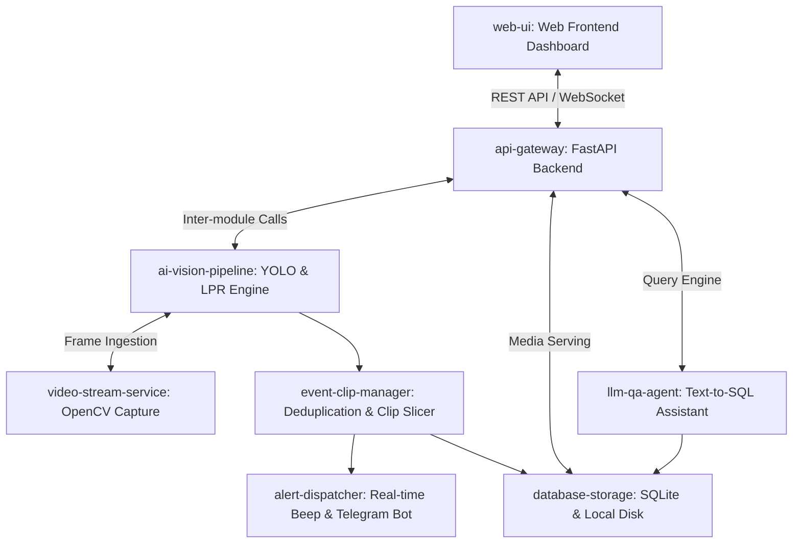
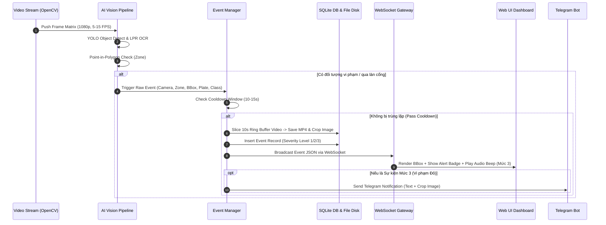

# Kiến trúc Kỹ thuật Hệ thống Giám sát Camera AI (SentriAI Mini)

## 1. Tổng quan Kiến trúc System Context & Topology

SentriAI Mini được thiết kế theo mô hình **Monolithic Modular Services** tổ chức trên nền tảng Python Backend kết hợp Frontend SPA tương tác thời gian thực. Hệ thống bao gồm 8 module chức năng chính giao tiếp qua REST API, WebSocket và In-Memory Bus để đảm bảo độ trễ nhỏ hơn 1 giây từ lúc phát hiện đối tượng đến khi hiển thị cảnh báo.



---

## 2. Danh sách Module & Trách nhiệm (Module Boundaries)

| Module ID | Tên Module | Trách nhiệm chính | Công nghệ đề xuất | Tranh chấp & Ranh giới |
|---|---|---|---|---|
| `web-ui` | Web Frontend Dashboard | Cung cấp UI 4 tab (Giám sát Cổng, Giám sát Khu vực, Cài đặt, Hỏi đáp AI), tương tác vẽ zone Canvas/SVG, phát âm thanh cảnh báo còi hiệu, chat AI. | HTML5, JavaScript (ES6+), Vanilla CSS, SVG Canvas | Không chứa logic tính toán AI hay truy vấn CSDL trực tiếp; chỉ gọi REST API & WebSocket. |
| `api-gateway` | FastAPI Gateway & Server | Cung cấp REST endpoints cho cấu hình zone, gán nhãn xe, upload dataset, truy vấn sự kiện, đính kèm static media và duy trì WebSocket connection. | Python 3.11, FastAPI, Uvicorn, WebSockets | Đảm nhận xác thực API key (nếu có), route request và chuyển tiếp sự kiện realtime. |
| `video-stream-service` | Ingestion Stream Loop | Đọc video stream từ RTSP hoặc file MP4 giả lập (`GATE-01.mp4`, `BAI-KIEM.mp4`), giải mã khung hình (frame decoding) ở tốc độ FPS cố định (&ge; 5 FPS). | OpenCV (cv2.VideoCapture), Threading Queue | Chỉ làm nhiệm vụ đọc và push khung hình vào Buffer Queue; không chạy model AI nặng trên main loop. |
| `ai-vision-pipeline` | YOLO & LPR OCR Engine | Chạy mô hình YOLOv8/v11 phát hiện đối tượng (Người, Xe nâng, Xe container…), EasyOCR/PaddleOCR cho biển số xe, và đánh giá tâm BBox trong đa giác (Point-in-Polygon). | Ultralytics YOLOv8, OpenCV, Shapely / PyClipper | Trả về bounding box, class name, OCR text, confidence và danh sách zone bị xâm nhập. |
| `event-clip-manager` | Event & Clip Processor | Lọc trượt trùng lặp (Cooldown 10-15s), phân loại mức độ cảnh báo (Mức 1/2/3), trích xuất và ghi file MP4 10s đính kèm bản ghi sự kiện vào DB. | FFmpeg / OpenCV VideoWriter, SQLite SQLAlchemy | Quản lý buffer khung hình trượt (Ring Buffer 10s) và xóa clip cũ khi đầy đĩa. |
| `alert-dispatcher` | Real-time Multi-channel Alert | Phản hồi sự kiện Mức 3 qua WebSocket tới Web UI (kích hoạt tiếng bíp sound alert) và đẩy notification kèm ảnh crop qua Telegram Bot API / Zalo OA. | Python asyncio, HTTPX / Telegram Bot API | Hoạt động bất đồng bộ; không làm nghẽn luồng xử lý video AI chính khi gửi tin nhắn mạng. |
| `llm-qa-agent` | AI Event Q&A Engine | Nhận câu hỏi ngôn ngữ tự nhiên từ Web UI, chuyển đổi câu hỏi thành câu lệnh SQL (Text-to-SQL), thực thi trên DB sự kiện, trả về kết quả số liệu + đính kèm link clip 10s. | OpenAI / Gemini API / Ollama, Rule-based Fallback Matcher | Có fallback Rule-based chạy offline khi không có Internet/API Key. |
| `database-storage` | CSDL & Disk Storage | Lưu trữ bảng thông tin Camera, Zone, Vehicle Whitelist/Blacklist, Custom Label, Event, và lưu file ảnh crop BBox, video MP4 10s trên ổ đĩa local. | SQLite3, Local File System (`/data/clips/`, `/data/crops/`) | Đảm bảo tính toàn vẹn dữ liệu và khóa ghi SQLite trong môi trường multi-thread. |

---

## 3. Ma trận Thực thi & Ranh giới Runtime (Framework & Runtime Boundary Matrix)

```
+-----------------------------------------------------------------------------------+
|                                 CLIENT BROWSER RUNTIME                             |
|  - Web UI (HTML/JS/Canvas/SVG)                                                    |
|  - Audio Beep Synthesizer / Web Audio API                                         |
|  - HTML5 Video Player (MP4 H.264 Playback)                                        |
+-----------------------------------------------------------------------------------+
                                         ^
                                         | REST / WebSocket
                                         v
+-----------------------------------------------------------------------------------+
|                                 PYTHON BACKEND RUNTIME                            |
|  - API Server: FastAPI / Uvicorn (Async IO)                                       |
|  - AI Pipeline: PyTorch / YOLOv8 / OpenCV / EasyOCR (Native C++/CUDA bindings)    |
|  - LLM Agent: LangChain / Direct API Client + Fallback Rule Engine                |
|  - Storage Access: SQLite ORM & File System I/O                                   |
+-----------------------------------------------------------------------------------+
```

- **Client Browser Runtime**: Chạy hoàn toàn trên trình duyệt người dùng. Không chứa bất kỳ thư viện backend hay secret keys. Tương tác Canvas vẽ zone được chuyển đổi về tỉ lệ phần trăm `% (0-100)` trước khi gửi xuống Backend.
- **Python Backend Runtime**: Chạy xử lý đa luồng (Multi-threading / Asyncio). Luồng Video Capture & YOLO Inferenced được tách khỏi luồng FastAPI Server bằng Python `Queue` hoặc `asyncio loop` để tránh nghẽn I/O.

---

## 4. Mạch Dữ liệu & Hợp đồng Giao tiếp (Data Flow & Integration Contracts)



---

## 5. Ràng buộc Chất lượng & Giả định Triển khai (Quality Constraints & Deployment)

1. **Độ trễ Xử lý (Latency Constraint)**: Độ trễ từ khi xe đi vào làn cổng/zone đến khi hiển thị kết quả LPR/Cảnh báo trên Web UI phải `< 1.0 giây`.
2. **Khả năng Xử lý Video (Video Stream Throughput)**: Tốc độ xử lý video tối thiểu đạt `&ge; 5 FPS` cho mỗi camera trên cấu hình phần cứng laptop/PC thông thường (CPU Intel Core i5/i7 hoặc Apple Silicon, có hoặc không có GPU NVIDIA).
3. **Chuẩn hóa Tọa độ Zone (Coordinate Normalization)**: Tọa độ đa giác từ UI gửi lên backend được lưu theo tỷ lệ phần trăm `(0.0 -> 100.0)` tương đối với kích thước khung hình, giúp không bị lệch khi thay đổi màn hình hiển thị.
4. **Định dạng Media (Media Format Invariant)**: Clip 10s trích xuất bắt buộc dùng codec `MP4 (H.264 / AAC)` để phát trực tiếp mượt mà trên mọi trình duyệt Chrome/Edge/Safari mà không cần transcode.

---

## 6. Quyết định Kiến trúc Tầm ảnh hưởng (Architectural Decision Records - ADRs)

Các quyết định kiến trúc consequential quan trọng đã được ghi nhận chi tiết tại:
- [ADR-001: Lựa chọn Kiến trúc Python Monolithic Modular Service với FastAPI](file:///d:/Hilab/Project34/.delivery/ADR/ADR-001-monolithic-python-fastapi.md)
- [ADR-002: Thuật toán Ray-Casting kiểm tra Tâm BBox trong Zone Đa giác](file:///d:/Hilab/Project34/.delivery/ADR/ADR-002-point-in-polygon-zone-evaluation.md)
- [ADR-003: Cơ chế Cửa sổ Thời gian Cooldown Lọc Trùng lặp Sự kiện](file:///d:/Hilab/Project34/.delivery/ADR/ADR-003-event-cooldown-deduplication.md)
- [ADR-004: Kiến trúc Hỏi đáp AI Text-to-SQL kết hợp Fallback Rule-based Engine](file:///d:/Hilab/Project34/.delivery/ADR/ADR-004-llm-text-to-sql-with-fallback.md)

---

## 7. Ma trận Vết Yêu cầu (Requirements Traceability Matrix)

| Requirement ID | Module sở hữu (Module ID) | Thành phần Xử lý chính | Quyết định Kiến trúc liên quan |
|---|---|---|---|
| **REQ-001** (LPR Gate) | `video-stream-service`, `ai-vision-pipeline`, `web-ui` | OpenCV Capture + EasyOCR + Gate KPI Counter | ADR-001 |
| **REQ-002** (Area Zone) | `ai-vision-pipeline`, `event-clip-manager`, `web-ui` | YOLOv8 + Shapely Point-in-Polygon | ADR-001, ADR-002 |
| **REQ-003** (Severity Class) | `event-clip-manager`, `alert-dispatcher` | Severity Evaluator (Green/Yellow/Red) | ADR-001 |
| **REQ-004** (Deduplication) | `event-clip-manager` | In-Memory Sliding Window Cooldown Cache | ADR-003 |
| **REQ-005** (Polygon Zone UI) | `web-ui`, `api-gateway` | SVG/Canvas Interactive Draw + API Zone Route | ADR-002 |
| **REQ-006** (Vehicle Tag) | `api-gateway`, `database-storage` | Whitelist/Blacklist CRUD API + SQLite | ADR-001 |
| **REQ-007** (Custom Label Tool) | `web-ui`, `api-gateway`, `ai-vision-pipeline` | Timeline Scrubber + Dataset Crop Manager | ADR-001 |
| **REQ-008** (AI Assistant Q&A) | `llm-qa-agent`, `database-storage`, `web-ui` | Text-to-SQL + Fallback Rule Engine + Video Player | ADR-004 |
| **REQ-009** (Multi-channel Alert) | `alert-dispatcher`, `web-ui` | Web Audio Beep + Telegram Bot Async Dispatcher | ADR-001 |
