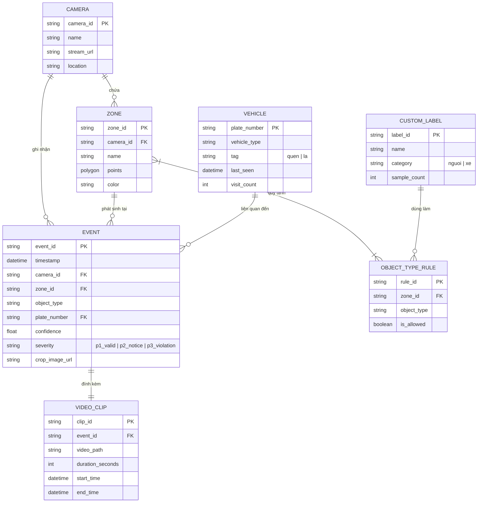

# Mô hình Miền Nghiệp vụ (Domain Model) - SentriAI Mini

## 1. Thuật ngữ Miền (Domain Terminology)

- **Camera Stream**: Nguồn luồng video thời gian thực từ RTSP hoặc file video mp4 giả lập.
- **Zone (Vùng giám sát)**: Đa giác 2D được định nghĩa bằng danh sách các đỉnh tọa độ `(x, y)` trên khung hình camera.
- **Bounding Box (BBox)**: Khung chữ nhật bao quanh đối tượng phát hiện được trong video, có tọa độ `(xmin, ymin, xmax, ymax)` và tâm `(cx, cy)`.
- **LPR (License Plate Recognition)**: Mô hình AI phát hiện vùng biển số xe và trích xuất chuỗi ký tự biển số (OCR).
- **Vehicle Tag (Nhãn xe)**: Phân loại xe thành `Xe quen` (Whitelist/Nội bộ) hoặc `Xe lạ` (Chưa đăng ký/Guest/Blacklist).
- **Custom Label (Nhãn custom)**: Nhãn đối tượng do người dùng định nghĩa bằng cách crop mẫu từ ảnh/video (ví dụ: Xe nâng, Người mặc áo phản quang).
- **Event (Sự kiện)**: Bản ghi ghi nhận một lượt xe qua cổng hoặc đối tượng xâm nhập zone tại một thời điểm.
- **Event Clip**: Đoạn video MP4 độ dài 10 giây được trích xuất quanh mốc thời gian phát sinh sự kiện.
- **Alert Severity (Mức độ cảnh báo)**: Phân cấp nguy hiểm của sự kiện:
  - Mức 1: Hợp lệ / Xe quen (Xanh).
  - Mức 2: Cần chú ý / Xe lạ (Vàng).
  - Mức 3: Vi phạm zone cấm (Đỏ).

---

## 2. Thực thể Nghiệp vụ & Mối quan hệ (Entities & Relationships)

---

## 3. Quy tắc Ràng buộc & Bất biến Nghiệp vụ (Invariants & Business Rules)

1. **Ràng buộc Point-in-Polygon (Tâm đối tượng vào Zone):** Một đối tượng được xác định là nằm trong Zone khi và chỉ khi điểm tâm `(cx, cy)` của Bounding Box rơi vào bên trong đa giác Zone.
2. **Bất biến Khử trùng lặp (Deduplication Invariant):** Hai sự kiện có cùng `(camera_id, zone_id, plate_number/object_type)` xuất hiện trong khoảng thời gian `< 15 giây` sẽ không tạo bản ghi Event mới, mà chỉ cập nhật mốc thời gian kết thúc hoặc bỏ qua.
3. **Bất biến Clip Chứng cứ 10s:** Mỗi Event được lưu vào cơ sở dữ liệu BẮT BUỘC phải tạo kèm đúng 1 file video MP4 10 giây (lấy 3s trước sự kiện, 7s sau sự kiện hoặc 5s trước - 5s sau).
4. **Quy tắc gán nhãn mặc định:** Mọi biển số lần đầu tiên được hệ thống LPR ghi nhận mà chưa có thông tin trong danh mục Vehicle sẽ mặc định gán nhãn `Xe lạ`.
